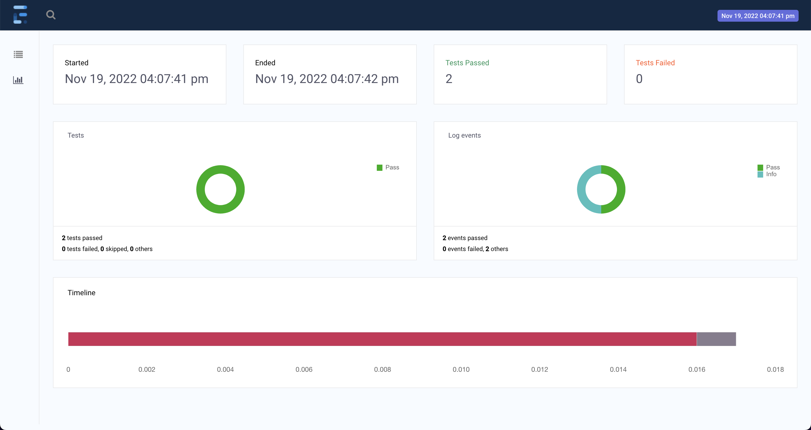

# Purpose

This is a framework with maven for test on RCB json using java,testng and rest assured. Intellij IDE is used to create
this.

#### Requirement

All the requirements are added in pom.xml need to run these before start running test
```mvn clean```

#### Execution

To run tests following steps needs to be followed:

- ```mvn test```  To run all the tests.
- Another method is to import the project in IDE and click right on ```TestCase.java``` -> select "Run TestCase" 

#### Reporting

- The execution report will be saved in HTML format with name ```Index.html```
Example:
